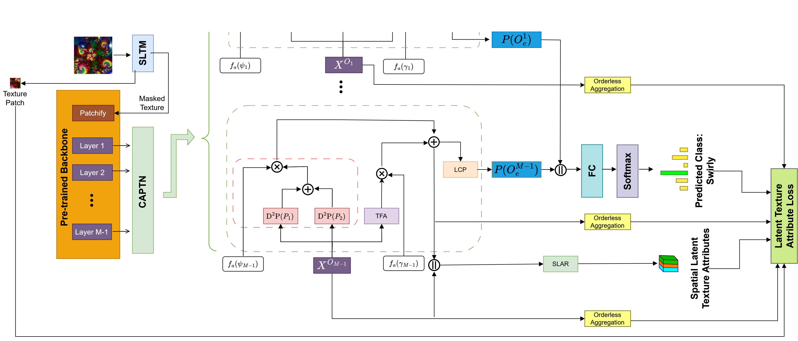
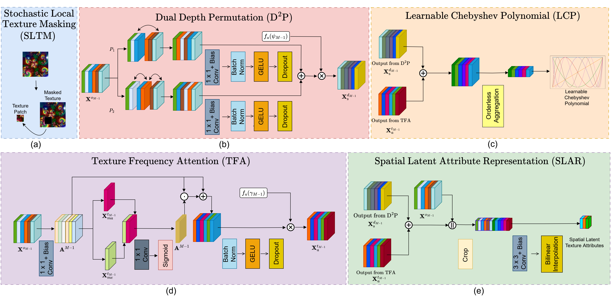

<h1 align="center" style="color: blue;">
    [CVPR 2025] Chebyshev Attention Depth Permutation Texture Network with Latent Texture Attribute Loss (CAPTN)
</h1>

<div align="center">
  <a href="https://openaccess.thecvf.com//content/CVPR2025/papers/Evani_Chebyshev_Attention_Depth_Permutation_Texture_Network_with_Latent_Texture_Attribute_CVPR_2025_paper.pdf" target='_blank'></a>
  <a href="https://cvpr.thecvf.com/media/PosterPDFs/CVPR%202025/34164.png?t=1750734283.7678244" target='_blank'></a>
</div>

<br> <!-- To add a line break and vertical space -->

<div align="center">
  <a href="https://pytorch.org/get-started/locally/"></a>
  <a href="https://pytorch-geometric.readthedocs.io/"></a>
  <a href="https://mlflow.org/"></a>
  <a href="https://hydra.cc/"></a>
</div>
<div align="center">
  
</div>

## :ledger: Table of Contents

- [:classical_building: CAPTN Architecture & LTA Loss](#classical_building-captn-architecture)
- [:mag: Components of CAPTN and LTA Loss](#classical_building-captn-components)
- [:file_folder: Folder Structure](#file_folder-folder-structure)
- [:package: Data Download](#package-data-download)
- [:hammer_and_wrench: Installation](#hammer_and_wrench-installation)
- [:computer: Start MLflow Server](#computer-start-mlflow-server)
- [:gear: Configuration](#gear-configuration)
- [:rocket: Train & Test](#rocket-train--test)
- [:speech_balloon: Contact](#speech_balloon-contact)
- [:pray: Acknowledgement](#pray-acknowledgement)
- [:books: Citation](#books-citation)

## :classical_building: CAPTN Architecture & LTA Loss

We introduce the Chebyshev Attention Depth Permutation Texture Network (CAPTN), a novel approach for texture representation and recognition that outperforms state-of-the-art methods in terms of efficiency, accuracy, and interpretability. Additionally, we propose the Latent Texture Attribute (LTA) Loss, a multi-objective loss function that enhances discriminative representation learning by jointly optimizing for classification accuracy, spatial texture preservation, and orderless consistency.



## :mag: Components of CAPTN and LTA Loss

(a) SLTM: extract a small patch from an input texture image, (b) $\mathrm{D}^2\mathrm{P}$: feature maps from backbone undergo depth permutation to diversify feature space, (c) LCP: enhanced Latent Texture Attributes undergo orderless aggregation and fit a learnable Chebyshev polynomial function, (d) TFA: use spatial texture frequencies to compute spatial attention, (e) SLAR: representation of spatial information for latent attributes and backbone features. SLTM and SLAR are used to compute Latent Texture Attribute Loss. $\textbar\textbar\$ represents concatenation, $\times$ represents matrix multiplied by a scalar, $\cdot$ represents matrix multiplication.




## :file_folder: Folder Structure

```plaintext
CAPTN/
├── conf/
│   └── dataset/
│       ├── common/
│       │   └── architecture.yaml
│       └── dtd.yaml
├── dataloader/
│   ├── __init__.py
│   └── dtd.py
├── src/
│   ├── __init__.py
│   ├── backbone.py
│   ├── build.py
│   ├── loss.py
│   ├── model.py
│   ├── test.py
│   ├── train.py
│   └── utils.py
├── .gitignore
├── main.py
├── config.py
└── README.md
dataset/
└── texture_material/
    └── dtd/
        ├── images/
        │   ├── banded/
        |   |   ├── banded_###.jpg
        |   |   └── ...
        │   ├── blotchy/
        |   |   ├── blotchy_###.jpg
        |   |   └── ...
        |   └── ...
        └── labels/
            ├── train1.txt
            ├── val1.txt
            ├── test1.txt
            └── ...
```
##### Create the `dataset/` folder in the parent directory of the current `GTN/` folder, so that `dataset/` and `GTN/` are at the same directory level:

```bash
mkdir -p ../dataset/texture_material
```

##### [Optional] Create the following directories in the project root directory to store logs and snapshots:

```bash
mkdir -p ./log ./snapshot
```

## :package: Data Download

Download datasets from the following links: [GTOS](https://1drv.ms/u/s!AmTf4gl42ObncLmEnEv4R5LyxT4?e=ekkFfX), [GTOS_MOBILE](https://1drv.ms/u/s!AmTf4gl42ObnblEtikrw4HfD9fc?e=LjJir4), [DTD](https://www.robots.ox.ac.uk/~vgg/data/dtd/download/dtd-r1.0.1.tar.gz), [KTH-TIPS2-b](https://www.csc.kth.se/cvap/databases/kth-tips/index.html), [FMD](https://people.csail.mit.edu/celiu/CVPR2010/FMD/)

## :hammer_and_wrench: Installation

Ensure you have Python 3.8.16 and the following installed:

```bash
hydra-core==1.3.2
mlflow==2.9.2
torch==1.12.1+cu113 torchvision==0.13.1+cu113 --extra-index-url https://download.pytorch.org/whl/cu113
torch-geometric==2.3.1
timm==0.6.7
numpy==1.24.4
Pillow==10.4.0
```

## :computer: Start MLflow server

Starting the MLflow tracking server remotely. The MLflow tracking server is accessible at the specified IP address (<remote_host>) and port number (<remote_port>). You can create an SSH tunnel to access it locally. 

```bash
mlflow server --host <remote_host> --port <remote_port>
ssh -N -f -L <local_host>:<local_port>:<remote_host>:<remote_port> <username>@<headnode_ip>
```

## :gear: Configuration

To change hyperparameters, backbone selection, or architecture settings, edit the appropriate YAML files located in the conf directory:

```bash
conf/dataset/dtd.yaml
conf/dataset/common/architecture.yaml
```

## :rocket: Train & Test

To run the main Python script. Specify GPU device index, split number and backbone with size:

```bash
python main.py \
       accelerator.device='0' \
       training.split=1 \
       backbone='convnext_nano'
```

## :speech_balloon: Contact
If you have any questions, feel free to reach out at: s220007@e.ntu.edu.sg

## :pray: Acknowledgement
The code for the DataLoaders was sourced from [pytorch-material-classification](https://github.com/jiaxue-ai/pytorch-material-classification).

## :books: Citation

If you find our work useful in your research please consider citing our publication:

```bibtex
@InProceedings{Evani_2025_CVPR,
    author    = {Evani, Ravishankar and Rajan, Deepu and Mao, Shangbo},
    title     = {Chebyshev Attention Depth Permutation Texture Network with Latent Texture Attribute Loss},
    booktitle = {Proceedings of the Computer Vision and Pattern Recognition Conference (CVPR)},
    month     = {June},
    year      = {2025},
    pages     = {23423-23432}
}
```